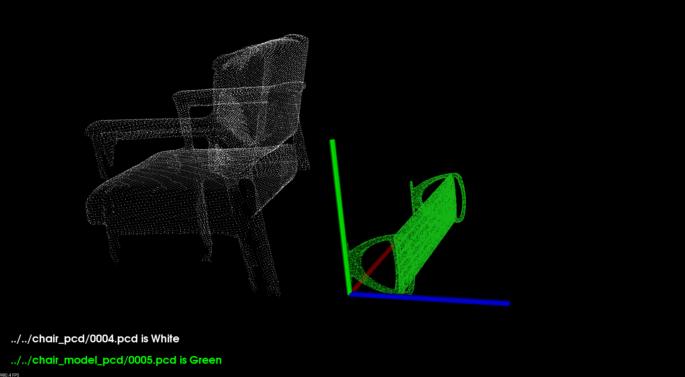
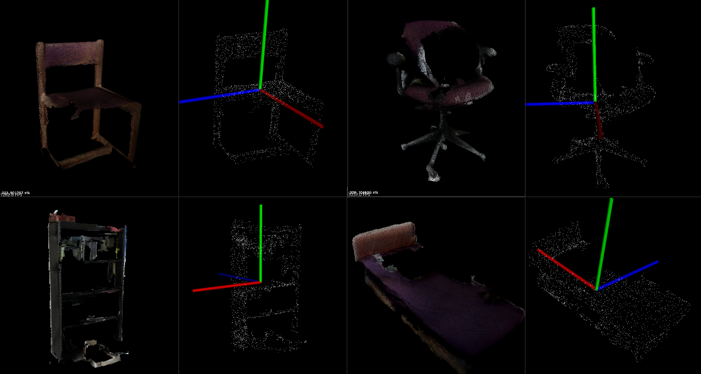

# DealWithSHREC

> 2018/07/31  Jiadai Sun  sunjiadai@foxmail.com

The main purpose of this project is to **generate a data set in HDF5 format** for PointNet as input. 

The network part is implemented at [MaxChanger/Pointnet_Pointnet2_pytorch](https://github.com/MaxChanger/Pointnet_Pointnet2_pytorch)  ([Fork & Modify From Here](https://github.com/yanx27/Pointnet_Pointnet2_pytorch) )

The directory structure looks messy. I will continue to improve it.

- **Python  / C++ / PCL / Shell Script**

|    Dimension Normalization     |  Contrast Query and Database   |    Sampling from Query    |
| :----------------------------: | :----------------------------: | :-----------------------: |
|  |  |  |

### Some steps

- run `python copymodel.py` copy 3308 `shrec17_data_jan27/shapenet/models/***.obj` to `model_obj/***.obj`

- run `obj2pcd.sh` , use `mesh_sampling_self` to render `model_obj/***.obj` to PointCloud,Generate a set number of point clouds  and save to `model_ply/***.pcd`, use `pcl_pcd2ply` transform `model_ply/***.pcd` to `model_ply/***.ply`

- run `ply_normalize.sh` use `normalization` to normalize`model_ply/***.ply` including location_normalization and dimension_normalization , save the `model_ply/***.ply` after normalizing to `model_ply_normalize/***.ply`

- run `python wrire_hdf5.py` , save `PointCloud and Label` to hdf5 file, prepare for the input of A
- use some scripts to help me quickly process large amounts of data
- model.txt(Part of train.csv) contain 3308 models from shapenet, named `wss.***`

### Some Code

- [x] `pointdeal_cpp/***.cpp`

  - normalization.cpp

    Pose Normalization and Location Normalization

  - resampling.cpp

    if the number of PointClode is less than 2048, we should upsampling and downsampling to 2048

  - mesh_sampling.cpp

    Used for desampling the number of Point Cloud to `-n_samples 2048`

    If I use the `pcl_mesh_sampling` in script to deal many `*.ply / *.pcd /` file, need to close the  windows and go on to the next one. I re-compile the file and can use the parameter `-no_vis_result`  to Prohibit window pop-up

- [x] `write_hdf5.py`

  Read the csv file and PointCloud generate by PCL

- [x] `get_hdf5_data.py`

  This model is used to see some information and check the correctness of `*.h5` 

- [x] `copymodel.py` & `copyply.py`

  copy the shapenet model in ObjectNN  and `*.ply`  in scenenn we will use to this folder 

**Unused File**

- [ ] `render_obj2png.py`

  An example use blender to render some 2D image

- [ ] `visualization.py`

   

